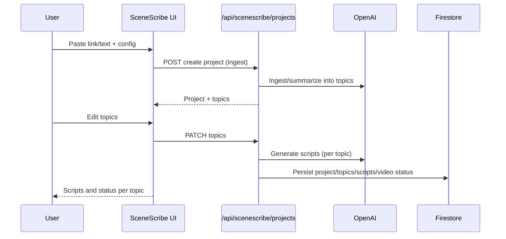

# SceneScribe (Day 7 of 30 Days of Product)

SceneScribe: link/text → topics → scripts → per-topic videos.

## Live demo
- Visit https://lawrencehua.com/scenescribe

## Problem & Solution
- **Problem:** Turning articles into structured explainer videos with scripts/captions is slow.
- **Solution:** Ingest link/text, auto-topic, edit topics, then generate scripts and per-topic videos.

## What’s inside
- Standalone Next.js app with SceneScribe lib (ingest, llm, store, video, logger) and types.
- APIs under `/api/scenescribe/projects` for create/update/scripts/videos; `.env.example` placeholders to fill.

## Run locally
1. Install deps: `npm install`
2. Copy `.env.example` to `.env` and provide your values
3. Start dev server: `npm run dev`
4. Open `http://localhost:3000`

## Notes
- For demos, use the live link above.
- Repo name: SceneScribe (Day 7 of 30 Days of Product)

## Architecture
```mermaid
flowchart TD
  U[User] --> UI[Next.js SceneScribe UI]
  UI --> API[/api/scenescribe/projects/*]
  API --> LIB[lib/scenescribe (ingest, llm, store, video)]
  API --> LOG[lib/logger]
  LIB --> OAI[OpenAI API]
  LIB --> FB[Firebase Firestore]
  UI --> TYPES[SceneScribe types]
```

## Sequence

